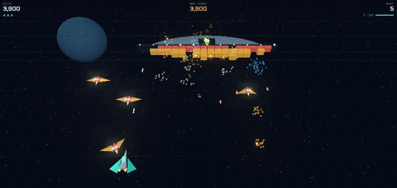
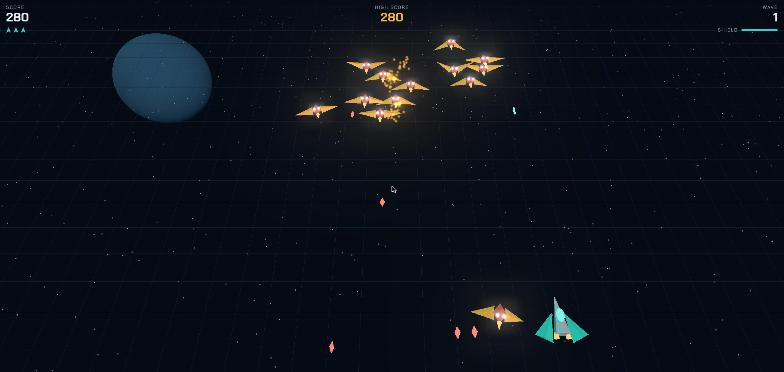
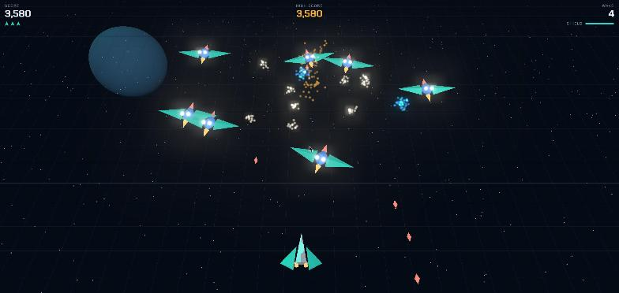
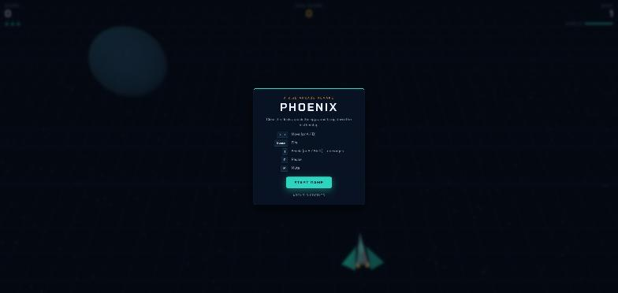

# Phoenix 2.5D

A remake of the 1980 arcade shooter **Phoenix**, rendered in 2.5D with Three.js: the action plays out on a flat plane, but every ship, bird and block is a 3D model under a tilted perspective camera, with a parallax starfield, bloom and particle explosions.

**Play it:** https://robertorenz.github.io/phoenix/



| Scout flock | Hatched phoenixes |
| --- | --- |
|  |  |



## The five waves

| Wave | Enemy | Notes |
| --- | --- | --- |
| 1 | Scout Flock | Small birds hold formation and peel off to dive-bomb you. |
| 2 | Raider Flock | Faster dives; you get a third shot on screen. |
| 3 | Phoenix Hatchery | Eggs drift in and hatch into large phoenixes. Wing hits only clip the wing, and it grows back. Hit the body. |
| 4 | Phoenix Fury | A bigger hatch, and a third shot again. |
| 5 | Mothership | Chew through the hull and the rotating belt, then hit the alien pilot. |

After the mothership falls the cycle repeats, faster. An extra ship is awarded every 10,000 points, and the high score is kept in the browser.

## Controls

| Action | Keys |
| --- | --- |
| Move | `←` `→` or `A` `D` |
| Fire | `Space` (or `↑` / `W`) |
| Shield | `↓`, `S` or `Shift` |
| Pause | `P` or `Esc` |
| Mute | `M` |

The shield lasts a moment, roots the ship in place while it is up, destroys anything that touches it, and takes a few seconds to recharge. On touch devices, on-screen buttons appear.

## Run locally

There is no build step, but the game is an ES module, so it needs to be served over HTTP:

```sh
python -m http.server 8000
```

Then open http://localhost:8000. Three.js is loaded from the jsDelivr CDN.

## Files

- `index.html` — page, HUD and modal markup
- `style.css` — HUD, modal and touch-control styling
- `game.js` — everything else: rendering, models, game logic, synthesized audio
- `docs/` — screenshots used in this README

## About the original

**Phoenix** reached arcades in 1980. It is generally credited to Amstar Electronics of Phoenix, Arizona, and was distributed by Centuri in North America and Taito in Japan.

It was among the first full-colour shooters built from distinct stages rather than one repeating screen, and its mothership finale is remembered as one of the earliest boss fights in video games. Its other signatures were the force-field shield, which protects the ship but pins it in place, and the large birds whose wings grow back unless you hit the body. This remake keeps all three, along with the five-wave structure.

## Credits

- Created by **Roberto Renz**, built with [Claude Code](https://claude.com/claude-code).
- Original game: Amstar Electronics / Centuri / Taito (1980).
- Rendering: [Three.js](https://threejs.org) (MIT License).
- Typeface: [Chakra Petch](https://fonts.google.com/specimen/Chakra+Petch) by Cadson Demak (SIL Open Font License).
- Sound effects are synthesized at runtime with the Web Audio API.

This is an unofficial, non-commercial fan tribute written from scratch. It uses no code, graphics or sound from the original game and is not affiliated with or endorsed by its rights holders. "Phoenix" and related marks belong to their respective owners.

## License

[MIT](LICENSE)
